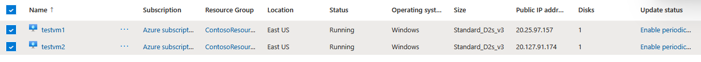
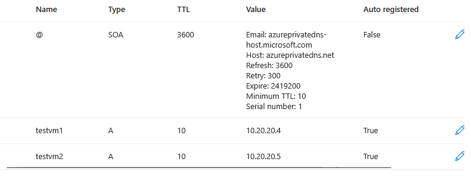

# Lab 02 - Configure DNS settings in Azure
Lab guide https://microsoftlearning.github.io/AZ-700-Designing-and-Implementing-Microsoft-Azure-Networking-Solutions/Instructions/Exercises/M01-Unit%206%20Configure%20DNS%20settings%20in%20Azure.html

## Goal 
Configure DNS name resolution via private DNS zone, linking the VNets for registration and resolution. Create two VMs for testing. 

## Architecture
Diagram with VNets, subnets and VMs: 

## Steps

1. **Create private DNS Zone**:
	- Azure services -> Private DNS zones -> + Create
	- RG name: ContosoResourceGroup
	- Name: Contoso.com
2. **Link subnet for auto registration:
	- Azure services -> Private DNS zones -> Contoso.com -> DNS Management -> Virtual Network Links -> + Add
	- Link name: CoreServicesVnetLink
	- VNet: CoreServicesVnet
	- Enable auto registration: ticked
	- Should be looking like this: 
3. **Create VMs:**
	- Select Cloud Shell icon (top right) -> poweshell
	- Upload the files azuredeploy,json and azuredeploy.parameters.json available in [GitHub](https://github.com/MicrosoftLearning/AZ-700-Designing-and-Implementing-Microsoft-Azure-Networking-Solutions/tree/master/Allfiles/Exercises)
	- Deploy the VMs with the code:
```powershell
$RGName = "ContosoResourceGroup"
   
New-AzResourceGroupDeployment -ResourceGroupName $RGName -TemplateFile azuredeploy.json -TemplateParameterFile azuredeploy.parameters.json
```
	- Go to Azure -> Virtual Machines
	- Verify both are created 

3. **Verify records are present in DNS zones**
	- Go to Private DNS zones -> Contoso.com -> DNS Management -> Recordsets
	- Verify A records are created for both VMs

	- Connect to VMs to test the name resolution:
		- Go to VMs and click on testvm1, connect to it downloading the RDP file. 
		- Check fo the name resolution for test vms. 
			- `ping testvm1.contoso.com`, `ping TestVM2.contoso.com`, `nslookup TestVM1.contoso.com`, `nslookup TestVM2.contoso.com`
		- The corresponding names should resolve to the IPs:
			- testvm1: 10.20.20.4
			- testvm2: 10.20.20.5
````
C:\Users\TestUser>nslookup testvm1.contoso.com
Server:  UnKnown
Address:  168.63.129.16

Non-authoritative answer:
Name:    testvm1.contoso.com
Address:  10.20.20.4


C:\Users\TestUser>nslookup testvm2.contoso.com
Server:  UnKnown
Address:  168.63.129.16

Non-authoritative answer:
Name:    testvm2.contoso.com
Address:  10.20.20.5
```