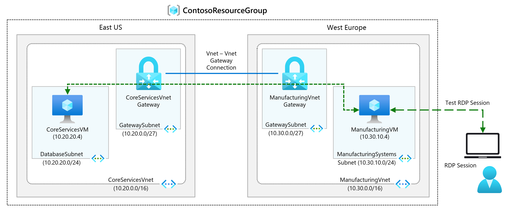

# Module 2 - Lab 01 - Create and configure a Virtual Network Gateway

Lab guide: https://microsoftlearning.github.io/AZ-700-Designing-and-Implementing-Microsoft-Azure-Networking-Solutions/Instructions/Exercises/M02-Unit%203%20Create%20and%20configure%20a%20virtual%20network%20gateway.html

## Goal

Configure a virtual network gateway to connect two VNets. 

## Architecture


## Steps

1. Deploy Manufacturing and CoreServices VMs
	- Test VMs from previous labs are used. Refer to the previous labs to see how the deployment is done via JSON files. Refer to lab guide and [Github](https://github.com/MicrosoftLearning/AZ-700-Designing-and-Implementing-Microsoft-Azure-Networking-Solutions/tree/master/Allfiles/Exercises/M02)
	- Once VMs are created, connect to each of them:
		- Go to the VM, select connect and RDP. 
		- Download the RDP file and use it to connect to the VMs
		- Open a Powershell terminal in both VMs. Take note of IPs and test connection from Manufacturing to CoreServices:
			```Powershell
				Test-NetConnection 10.20.20.4 -port 3389
			```
		- Connection should fail

2. Create CoreServicesVnet Gateway:
	- In the service "Virtual network gateways", click on +Create and create the gateway with the following information. Any field not mentioned, leave it by default.
		- Name: CoreServicesVnetGateway
		- Region: East US
		- Gateway Type: VPN
		- SKU: VpnGw1AZ
		- Virtual network: CoreServicesVnet
		- Subnet: GatewaySubnet (default)
		- Public address name: CoreServicesVnetGateway-ip
		- Enable active-active mode: disabled
		- Configure BGP: disabled
	- Proceed with next step. Deployment would take typically 30-60mins

3. Create ManufacturingVnet Gateway
	- Create a new subnet for the gateway:
		- Go to the VNet -> settings -> Subnets and click on +Subnet. Use the following information:
			- Subnet purpose: Virtual Network Gateway
			- Size /27
			- Leave the rest by default and click on add
	- Create the Virtual Network Gateway using the same procedure as before, but using the following information:
		- Name: ManufacturingVnetGateway
		- Region: WestEurope
		- Gateway Type: VPN
		- SKU: VpnGw1AZ
		- Virtual network: ManufacturingVnet
		- Subnet: GatewaySubnet (default)
		- Public address name: ManufacturingVnetGateway-ip
		- Enable active-active mode: disabled
		- Configure BGP: disabled
	- Wait until the Virtual Network Gateways are deployed. Typically 30-60mins

4. Connect the 2 VNets
- Go to the Manufacturing VNG -> Connections and click on + Add. Fill out with the following information:
	- Basics tab:
		- Establish bidirectional connectivity: enabled
		- First Connection Name: ManufacturingGW-to-CoreServicesGW
		- Second Connection Name: CoreServicesGW-to-ManufacturingGW
		- Connection type: VNet-to-VNet
		- Region: West Europe
	- In Settings tab:
		- First virtual Network Gateway: ManufacturingVnetGateway
		- Second virtual network gateway: CoreServicesVnetGateway
		- Shared key (PSK): abc123
	- Leave the rest by default and click on Create after reviewing it.  
	- Wait for the connection to be in "Connected" state. If after some time it's still in "Unknown" state, check via cloud shell:
```Powershell
PS /home/gilberto> Get-AzVirtualNetworkGatewayConnection -Name "CoreServicesGW-to-ManufacturingGW" -ResourceGroupName "ContosoResourceGroup" | Select-Object Name, ConnectionStatus, ProvisioningState

  

Name                              ConnectionStatus ProvisioningState

----                              ---------------- -----------------

CoreServicesGW-to-ManufacturingGW Connected        Succeeded

  

PS /home/gilberto> Get-AzVirtualNetworkGatewayConnection -Name "ManufacturingGW-to-CoreServicesGW" -ResourceGroupName "ContosoResourceGroup" | Select-Object Name, ConnectionStatus, ProvisioningState

  

Name                              ConnectionStatus ProvisioningState

----                              ---------------- -----------------

ManufacturingGW-to-CoreServicesGW Connected        Succeeded
```

5. Verifying the connection:
	- Repeat the same test from step 1, performing a test connection from the Manufacturing VM. This time, it should succeed:
		```Powershell
PS C:\Users\TestUser> Test-NetConnection 10.20.20.4 -port 3389


ComputerName     : 10.20.20.4
RemoteAddress    : 10.20.20.4
RemotePort       : 3389
InterfaceAlias   : Ethernet
SourceAddress    : 10.30.10.4
TcpTestSucceeded : True
		```

6. Clean up the resources that are no longer needed. Virtual network gateways are pricey!!!