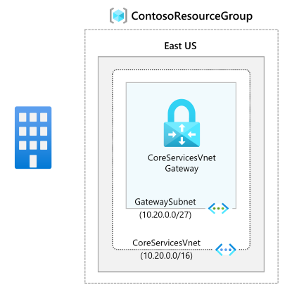

# Module 3 - Lab 01 - Configure an ExpressRoute Gateway

Lab guide: https://microsoftlearning.github.io/AZ-700-Designing-and-Implementing-Microsoft-Azure-Networking-Solutions/Instructions/Exercises/M03-Unit%204%20Configure%20an%20ExpressRoute%20Gateway.html

## Goal

Create an ExpressRoute Gateway that enables connect on-prem:
1. Virtual Network Gateway: IP routes exchange between the networks and routes the traffic

## Architecture

## Steps

1. Create or reuse the CoreServices VNet from [the first lab](../../../vnets/labs/01-design-implement-vnet.md) with its Gateway subnet.
2. Create the Virtual Network Gateway. Very Similar as the steps followed for the [VPN gateway](../../azure-vpn-gateway/lab/m02-03-vnet-gateway.md):
	- Go to Virtual Network Gateways and click on + Create. Use the following information to create the gateway:
		- Name: CoreServicesVnetGateway
		- Region: East US
		- Gateway type: ExpressRoute !!!! IMPORTANT
		- SKU: Standard
		- Virtual network: CoreServicesVNet
		- Subnet: GatewaySubnet (default)
	- Click on Review + Create and create the resources. It will take up to 45 minutes to complete. 