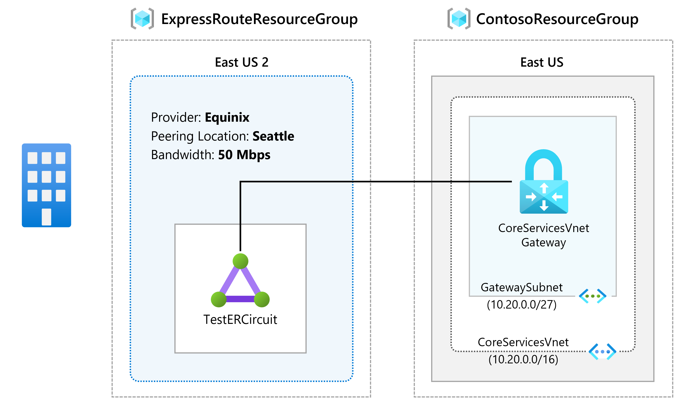
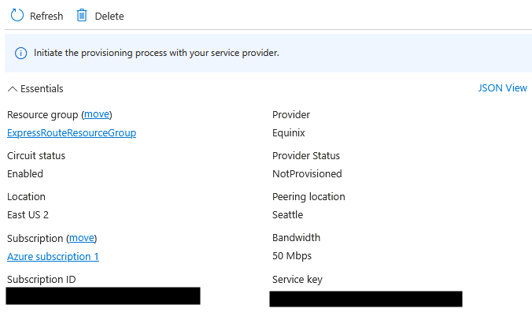

# Module 3 - Lab 02 - Provision an ExpressRoute circuit

Lab guide: https://microsoftlearning.github.io/AZ-700-Designing-and-Implementing-Microsoft-Azure-Networking-Solutions/Instructions/Exercises/M03-Unit%205%20Provision%20an%20ExpressRoute%20circuit.html

This is a continuation of the [previous lab](m03-01-expressroute-gateway.md)
## Goal

Learn how to provision an ExpressRoute circuit via Azure Resource Manager

### Architecture



## Steps

1. Create and provision the ExpressRoute circuit
	- Go to ExpressRoute circuits and create a new circuit
	- Use the following information:
		- ResourcesGroup: create a new resource group called ExpressRouteResourceGroup.
		- Select standard resiliency
		- Circuit details:
			- Port type: provider. 
			- Region: East US 2
			- Circuit name: TestERCircuit
			- Peering location: Seattle
			- Provider: Equinix
			- Bandwidth: 50Mbps
			- SKU tier: standard
			- Data billing model: Metered
	- Click on Review + Create and create the circuit. 

2. Retrieve Service key
	- Under ExpressRoute circuits a customer can see all the circuits that they have created. 
	- Each circuits has its own properties. The Service Key is an important parameter that service providers would need to complete the provisioning process. This key is specific to the circuit and it must be sent to the provider for provisioning. 
	- Go to the Provider status section, it gives provisioning information on the service-provider side. Circuits status section provides the state on the Microsoft side. 
		1. Provider status: Not provisioned and Circuit status: enabled
		2. When provider is enabling the circuit: Provider status: provisioning and Circuit status: enabled
		3. When it's ready to use: Provider status: Provisioned and Circuit status: enabled


4. Deprovision the circuit
	- Important step for the lab, if not deprovisioned, it will be billed.
	- To deprovision, provider status must be "Not provisioned"
	- Open a powershell and delete the circuit by deleting the RG:
		```Powershell
		Remove-AzResourceGroup -Name 'ExpressRouteResourceGroup' -Force -AsJob
		```
	- Once removed, remove the Virtual Network Gateway for the Express route if needed 
