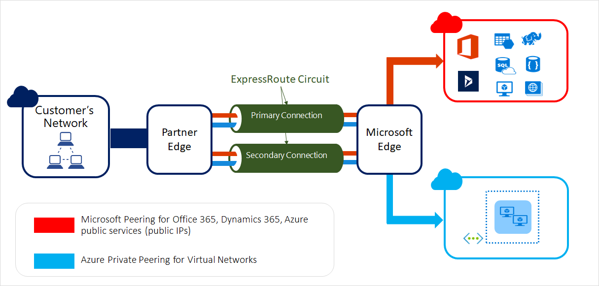

# Azure ExpressRoute 

ExpressRoute extends on-premises networks into Microsft Azure using a private connection, via a connectivity provider (ISPs, exchangers, etc). ExpressRoute establishes connections to various Microsoft cloud services, including Azure and MS 365. 

Connectivity can be from an IP VPN network, a point-to-point Ethernet network, or a virtual corss-connection through a connectivity provider at a colocation facility (exchange). Express routes offers reliability, faster speeds, consistent latencies and higher security. 

A basic architecture: 

### Components that make possible an ExpressRoute:

- Physical customer site: on-prem. Physical premises where a customer has its network. 
- Express route circuit: connected by a partner of some kind. Linked up in one of the co-locations where MS and the partner have presence.  secure places 
- Meet me: secure places where partner connections/circuits encounter Microsoft's. Partner needs to create a cross-connect through the meet me route in the MS routers, and directly into Microsoft secure edge. 
- Microsoft Secure Edge: Microsoft routers that enables traffic to come into the Microsoft network. 
- Microsoft services: with public IPs. M365, SQL DB, etc
- Azure: where the private address space is located.

ExpressRoute by default has high availability, and by default its resilience is being managed by a third party (partner/provider) on behalf of the customer and microsoft. You connect into ExpressRoutes with two connections by default, separate routers, independent circuits, divers fiber paths. 

Resiliency achieved with two BGP sessions (pri + sec) + redundant Microsoft secure edge routers. Provider connects you to both paths. 

The traffic that traverse the ExpressRoute is whatever you pick, as a connection against Azure via VPN gateway or Microsoft services can be estbalished, using the Azure publicly addressable IPs. 

### ExpressRoute connectivity models

2 ways:
- Service provider model:
	- CloudExchange colocation: customer needs to be colocated in a facility with a cloud exchange. Virtual cross-connection from customer to Microsoft through the colocation provider's Ethernet exchange. Either L2 or L3 cross-connections. 
	- Point-to-point Ethernet connection: on-premises to Microsoft cloud with dedicated point-to-piint Ethernet links. P2P providers offer L2 connections.
	- Any-to-any (IP VPN) connection: integration of WAN with Microsoft Azure via an IP VPN (typically MPLS VPN). Offer any-to-any connectivity between branch offices and DCs. Microsoft cloud can be interconnect to customer's WAN to make it like any other site. Managed L3 connectivity. 
- ExpressRoute Direct: connect to Microsoft cloud at a peering location which are distributed across the world. Provides dual 100-Gbps or 10-Gbps connectivity, supporting Active/Active connectivity at scale. When a ExpressRoute Direct is requested, the customer is provisioned with a pair of fibre ports in the Microsoft Secure Edge, so it needs to run fiber lines from its On-Prem to the MSSE. Customer deals with low-level connections, so light levels and everything can be monitored over the L1 and L2. On top of the circuits, you can run the expressroute connection. To achieve this, an ExpressRoute circuit needs to be provisioned from the on-prem to the Azure VNET, passing through the MSSE. Separately, other services can be run over the same physical connection. Achieved with QinQ encapsulation, connections are separated from each other. Circuits can vary on its bandwidth, ExpressRoute Direct circuits can be provisioned at 10 or 100 Gbps, which would allow you to provision smaller circuits up to 100Gbpps. The level of flexibility in terms of scale and size is vast in ExpressRoute Direct compared to an ExpressRoute via a service provider. 

Choosing any of the models will depend on the customer requirements, such as performance, budget and control over the network. 

|Feature/Aspect|ExpressRoute using a Service Provider|ExpressRoute Direct|
|---|---|---|
|Usage cases|Small to medium sized business looking for a simple setup with managed services|Large enterprises with mission-critical applications requiring high-performance connectivity|
|Connectivity|Connection via a service provider's infrastructure|Direct connection to Microsoft's network through dual 10-Gbps or 100-Gbps ports|
|Circuit SKUs|Ranges from 50 Mbps to 10 Gbps|10-Gbps: 1, 2, 5, 10 Gbps; 100-Gbps: 5, 10, 40, 100 Gbps|
|Optimization|Optimized for single tenant|Optimized for a single tenant with multiple business units|
### Azure ExpressRoute SKUs

- Local SKU: connectivity to a single Azure region. Suitable for low latency access to resources in a particular Azure region
- Standard SKU: multiple Azure regions within the same geopolitical area. Businesses that operate within a specific region but need access to resources across multiple locations
- Premium SKU: All regions globally. Ideal for multinational orgs that require seamless connectivity to Azure resources across different continents. 

### Peering models for ExpressRoute

Two peering schemes:
- Private peering: secure, high-performance connectivity to Azure resources. Connects the on-prem with the Azure resources that are located in Virtual Networks and that have IP addresses in a private address space. To achieve this communication, on-prem and Azure should have not overlapping address spaces. Cannot use the public IP from a resource via a private peering. Uses ExpressRoute circuit.
- Microsoft peering: suitable for accessing Microsoft SaaS and PaaS services. Connects Express route with Azure PaaS, M365 and Dynamics 365. Uses public IP traffic via Internet. 

ExpressRoute locations, know as well as peering locations or meet-me locations, are colocation facilities where Microsoft Secure Edge devices are situated. These are the entry points to Miocrosoft's network and are globally ditributed, offering the ability to connect to Microsoft's network worldwide. To choose a peering location, consider:
- Proximity to your data centers: choose as close to DCs to minimize latency and improve the performance of the applications. On the ISP side, a shorter circuit would be cheaper. 
- Azure region connectivity: Ensure location provides connectivity to the Azure regions you need access. This is importan when you use Local or Standard SKU, which aren't globally available resources. 
- Network Service Provider availability: Check that the desired network service provider is available at the peering location. The NSP is the one that enables your physical connection to Azure ExpressRoute. Price and reliability are the most important point when choosing a NSP. 
- Bandwidth requirements: Ensure the peering location can support the required bandwidth. Different locations may have different bandwidth ooptions. 
- Cost considerations: Costs varies based on the peering location, the NSP chose and the bandwidth required. 
- Compliance and regulatory requirements: if any, ensure that the peering location meets these standards. Might include data residency or industry specific regulations. 
- Future growth and scalability: bear in mind future growth plans and ensure that the peering location can accommodate increased bandwidth and other connections when evolving