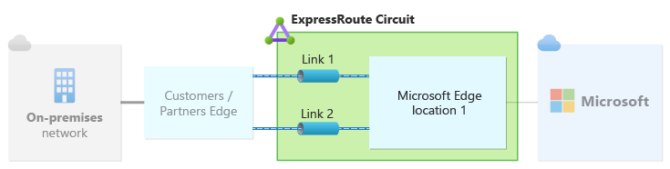
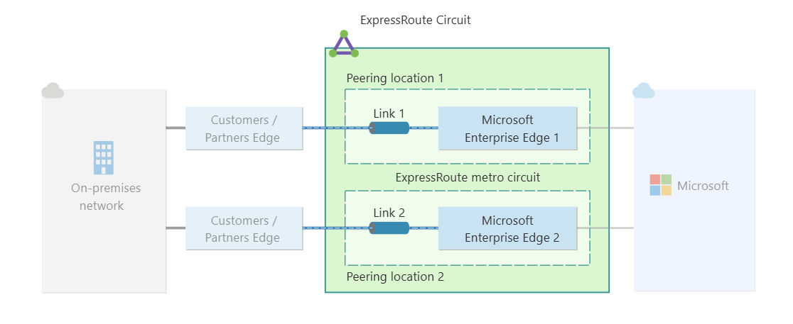
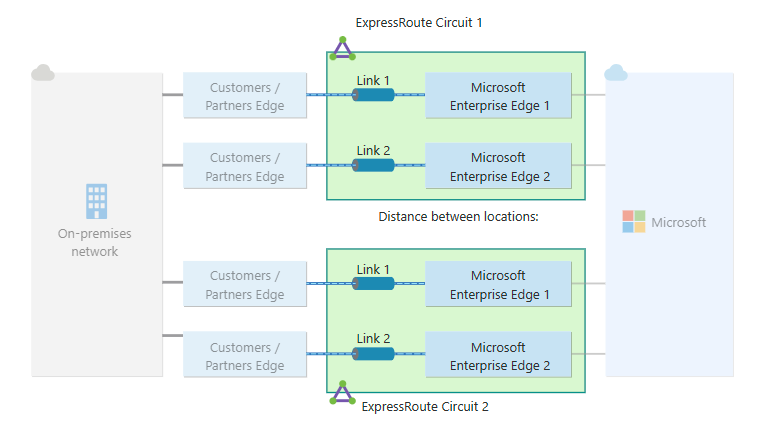
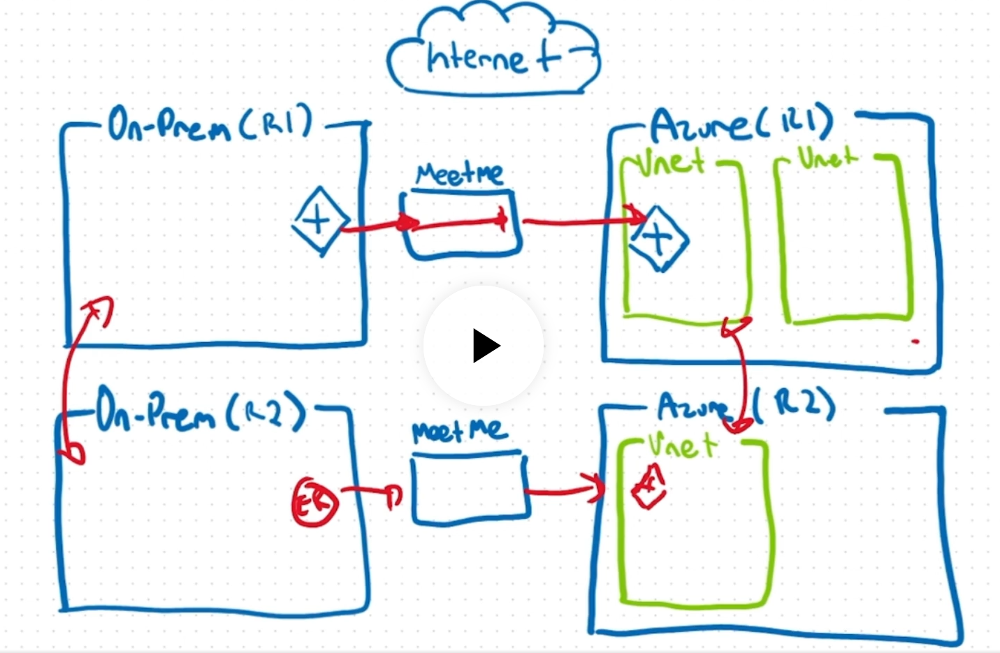

# ExpressRoute circuit design for reliability

Resiliency: prevent failures and, in the event they do occur, restore applications to a fully operational state.

Availability: consistent access to applications or workloads. 

Customer must plan for reliability based on business needs and application requirements. 

An ExpressRoute circuit has three resiliency types:
- Standard resiliency: offers a single circuit with two connections configured at a single site. Active-Active configuration to facilitate failover across the two connections of the circuit.  Only one peering location. 

- High resiliency: or ExpressRoute metro. Enables the use of multiple sites within the same Metro area to connect on-prem through ExpressRoute with Azure. This offers site diversity by splitting a single circuit across two sites (two peering locations). One connection established at one site and another connection at a different site.

- Maximum resiliency: Eliminates any single point of failure within the Microsoft network path. Pair of circuits across two distinct locations for site diversity with ExpressRoute. Achieves the highest level of resilience for business and/or mission-critical workloads. Enhance reliability, resiliency and availability. This method uses two ExpressRoute circuits. 

At the end, in a real environment where two interconnected DCs are needed to connect, if the customer creates a Express route connection from one DC in one region to the Azure peering location of that region, and the other DC in other region to the Azure peering location of that region, if VNets of both regions are peered as well, a good resiliency is achieved, as if any of the paths from one network to another fails, traffic will find its way to switch over another path. This can be tailored using BGP communities. 

In a real environment requiring connectivity from two interconnected data centers, a resilient design can be achieved if the customer connects each DC to the Azure peering location in its respective region through separate ExpressRoute circuits, while also peering the VNets across both Azure regions. In that case, if one primary path fails, traffic may be able to use an alternative path through the other DC and Azure region, provided the routing design allows it. Path preference and failover behavior can be influenced through BGP policy, including the use of BGP communities where applicable.