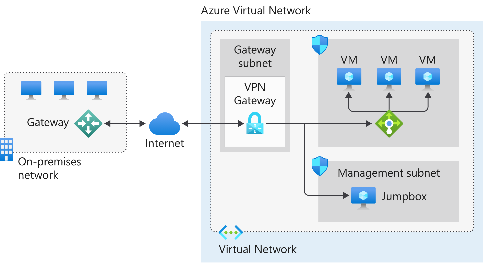

# Site-to-Site VPN

S2S VPN creates a secure connection to a VNet from another VNet or a physical network. 

From the diagram above, S2S VPN would connect to on-premise using IPsec tunnel over Internet connection. The Azure VNet holds any cloud application and the Azure VPN gateway components, while on-premise hold your gateway and local resources. That gateway will send encrypted traffic via the IPsec tunnel over Internet. 

The Azure VPN gateway is made up these elements:
- VNet gateway
- Local network gateway
- Connection
- Gateway subnet

After the VPN gateway, the traffic in azure can be routed to an internal load balancer in the front end and, after that, to the corresponding cloud application or resources. Benefits:
- Simplified configuration and maintenance.
- Encrypted data and traffic between on-premises gateway and Azure gateway
- Allowing future network requirements. 

### Local Network Gateway:

The Gateway you have on-premise. a Local Network Gateway is created in Azure to  represent the public IP of the on-premises gateway. BGP can be configured. If Active Active (2 local gateways), a creation of another Local Network Gateway in Azure should be created, representing the public IP Address of the second on-premise gateway. 

A VPN connection would be created in Azure linking both the VPN gateway and the Local Network Gateway. 

If Active-Active is selected, 2 public IPs would be needed in Azure to accomplish this setup. 

Each tunnel has a throughput of 1Gbps. Gateways may support more, but each tunnel would be limited to 1Gbps. 

### HA Configurations:

You may connect both local gateways to one gateway if you are active-standby. 

You may connect one of the local gateways to both VPN gateways. 

If active-active in both sites, you may connect both local gateways to both VPN gateways in Azure, so 4 tunnels in total. 

### As usual in networking, if connectivity is done within VNets in Azure, and there is also a connection to on-prem, you can manage to have connectivity with different VNets than the one with the gateway. 