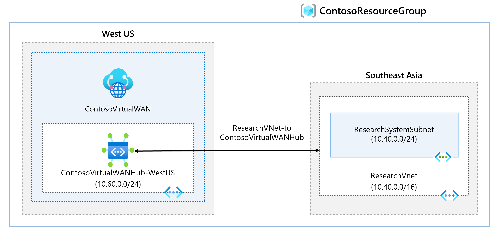

# Module 2 - Lab 02 - Create a Virtual WAN by using Azure Portal

Lab guide https://microsoftlearning.github.io/AZ-700-Designing-and-Implementing-Microsoft-Azure-Networking-Solutions/Instructions/Exercises/M02-Unit%207%20Create%20a%20Virtual%20WAN%20by%20using%20Azure%20Portal.html

## Goal

Create a Virtual WAN and its hub. Connect a VNet to the Virtual Hub

### Architecture

## Steps

1. Create a Virtual WAN
	- In the portal, find the Virtual WANs from resources list and click on + Create
	- Use the following information to create the Virtual WAN. Leave the not mentioned parameters by default
		- Resource group location: choose any. WAN is a global resource, so pick the region based on the needs of the network. 
		- Name: ContosoVirtualWAN
	- Click on Review + Create to create the VirtualWAN  
2. Create a virtual hub
	- In the Virtual WAN just created, go to Connectivity -> Hubs and click on + New Hub
	- Use the below information to create the hub:
		- Basics tab:
			- Region: West US
			- Name: ContosoVirtualWANHub-WestUS
			- Hub private address space: 10.60.0.0/24
			- Virtual hub capacity: 2 Routing infrastructure units
		- Site to site tab:
			- Select yes when asked to create a Site to Site VPN Gateway
			- Gateway Scale units: 1 scale unit = 500 Mbps x2
	- Click on Review + Create and then Create. The creation of the hub will take 30-45mins
3. Connect a VNet to the hub:
	- Inside the Virtual WAN ContosoVirtualWAN, go to Connectivity -> Virtual network connections and add a connection
	- Use the following information to create the connection:
		- Connection name: ContosoVirtualWAN-to-ResearchVNet
		- Hubs: ContosoVirtualWANHub-WestUS
		- Virtual Network: ResearchVNet
		- Propagate to none: yes
		- Associate Route Table: Default 