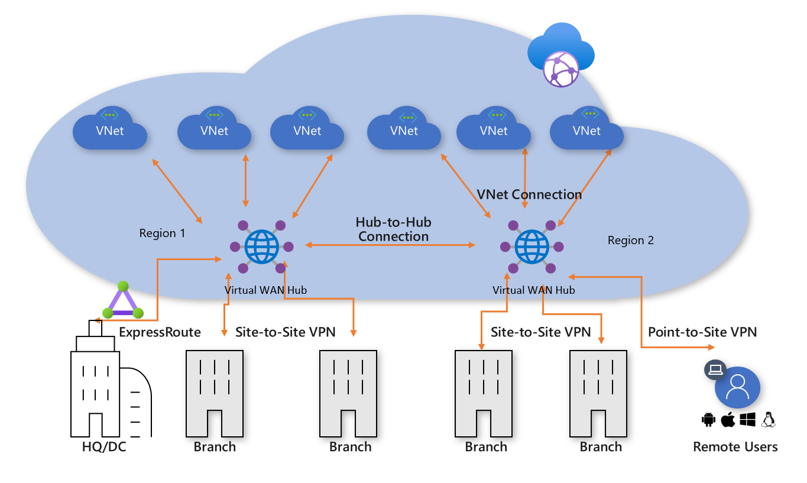

# Connect remote resources with Azure Virtual WANs

Service that combines many networking, security and routing functionalities together to provide a single operational interface. Takes a lot of managing work away from the engineer designing. 

When there are complex setups, such as many Azure regions, different on-premise locations and telecommuters. An Azure Virtual WAN uses an established connection either via VPN, ExpressRoute, etc, between on-premises to Azure WAN, the WAN will route the traffic as it needed based on routing decision. It allows to reach the on-premise DC with a branch, but also the branch or the DC with cloud based applications. 

Behind the scenes, a VWAN creates a (microsoft) managed VNet. so VNet peering (transitive) is available. NVAs appliances can be connected to that managed virtual network, as routes can be manipulated. 

Virtual WAN hubs can be spread across different regions. Virtual WAN supports ExpressRoute, S2S VPN, P2S VPN so on-premises would have dedicated connections into Azure, and Virtual WAN from different regions can be interconnected between them, so full mesh connectivity is possible using the Virtual WAN, traversing between one region to another. 

### Virtual WAN features:
- Branch connectivity. Can be created with cloud on ramp devices such as SD-WAN or VPN CPEs
- S2S VPN
- P2S VPN
- ExpressRoute
- Intra-cloud connectivity
- VPN ExpressRoute inter-connectivity
- Routing, Azure Firewall and encryption for private connectivity. 

### Steps to create a Virtual WAN
1. Virtual WAN: virtual overlay of the Azure Network, a collection of multiple resources. Contains links to all virtual hubs within the virtual WAN. Virtual WANs are isolated from each other and can't contain a common hub.
2. Hub: Virtual-hub is a Microsoft-managed virtual network. Contains various service endpoints to enable connectivity. 
3. Hub virtual network connection: used to connect the hub to the VNet. A VNet can be connected to only one virtual hub.
4. hub-to-hub connection: Hubs are all connected to each other in a virtual WAN. 
5. Hub route table: multiple routes can be applied to manipulate the traffic as desired within the virtual hub. If you want to restrict communication, that's possible. 
6. Site (optional): S2S connections. 

### Virtual WAN SKU

2 types:
- Basic: 
	- Hub type: basic
	- Supported: S2S VPN only
- Standard:
	- Hub type: standard
	- Supported: ExpressRoute, P2Sm S2S, inter-hub and VNet-to-VNet transiting through the virtual hub, Azure Firewall, network virtual appliances in a virtual WAN. 