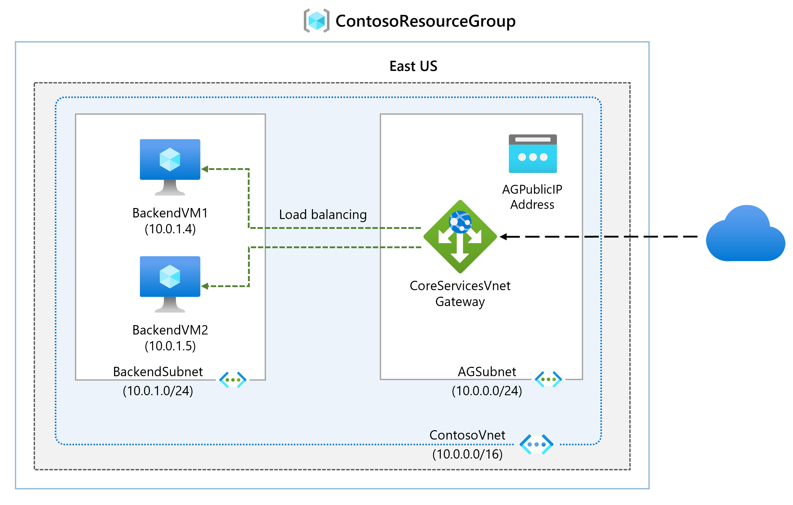
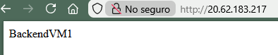
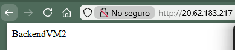

# Module 4 - Lab 03 - Deploy Azure Application Gateway

Lab guide: https://microsoftlearning.github.io/AZ-700-Designing-and-Implementing-Microsoft-Azure-Networking-Solutions/Instructions/Exercises/M05-Unit%204%20Deploy%20Azure%20application%20gateway.html

## Goal

Create an application gateway to load balance traffic to specific backend VMs 

## Architecture



## Steps

1. Create the application gateway. 
	- Search for the application gateway resource, and select + Create.
	- In Basics (leave not mentioned by default):
		- Resource group: ContosoResourceGroup
		- Application Gateway name: ContosoAppGateway
		- Region: East US
		- Virtual Network: Create new
			- Name: ContosoVNet
			- Address Space: 10.0.0.0/16
			- Subnet name: change default to AGSubnet
			- Address range: 10.0.0.0/24
	- In Frontends:
		- Frontend IP address type: Public
		- Public IPv4 address: Add new.
		- Name: AGPublicIPAddress
	- In Backends: 
		- Add a backend pool:
			- Name: Backend Pool
			- Add backend pool without targets: yes
	- In Configuration:
		- Add a routing rule:
			- Rule name: RoutingRule
			- Priority: 100 
			- Listener: 
				- Listener name: Listener
				- Frontend IP: Public IPv4
			- Backend targets:
				- Target type: Backend pool 
				- Backend target: BackendPool
				- Backend settings: Add new:
					- Backend setting name: HTTPSetting
					- Backend port: 80
	- Finally, proceed until Review + Create and create the application gateway.

2. Add Subnet for backend servers 
	- Subnet name: BackendSubnet
	- Address range: 10.0.1.0/24

3. Create virtual machines
	- Create a Powershell session.
	- Upload the backend.json, backend.parameters.json and install-iis.ps1 that can be found in the [Github](https://github.com/MicrosoftLearning/AZ-700-Designing-and-Implementing-Microsoft-Azure-Networking-Solutions/tree/master/Allfiles/Exercises/M05)
	- Deploy the ARM templates to create the VMs:
			```Powershell
			$RGName = "ContosoResourceGroup"
   
			New-AzResourceGroupDeployment -ResourceGroupName $RGName -TemplateFile backend.json -TemplateParameterFile backend.parameters.json``
	- Install IIS on each VM:
		- This is needed to be a backend server. Install it on BackendVM1 using a Powershell session:
			```Powershell
			Invoke-AzVMRunCommand -ResourceGroupName 'ContosoResourceGroup' -Name 'BackendVM1' -CommandId 'RunPowerShellScript' -ScriptPath 'install-iis.ps1'
			```
		- Run the command again for Backend VM2:
				````Powershell
				Invoke-AzVMRunCommand -ResourceGroupName 'ContosoResourceGroup' -Name 'BackendVM2' -CommandId 'RunPowerShellScript' -ScriptPath 'install-iis.ps1'
				```

4. Add backend servers to backend pool
	- Go to ContosoAppGateway and undersettings go to settings > Backend pools and select BackendPool
	- Under Backend targets, in Target type select Virtual machine. Under target, select BackendVM1-nic. Repeat this process to add BackendVM2-nic. Click on Save
	- Go to Monitoring > Backend Health, check that both targets are healthy. 

5. Test the application gateway
	- In the Application Gateway overview page, find the frontend public IP address. In this case: 20.62.183.217 (AGPublicIPAddress)
	- Copy the public IP address and paste it into the address bar of a browser. A valid response should be received that states which is the Backend server that is replying.
	- Refresh the page multiple times to ensure the load balancing function is done properly between BackendVM1 and BackendVM2
 


