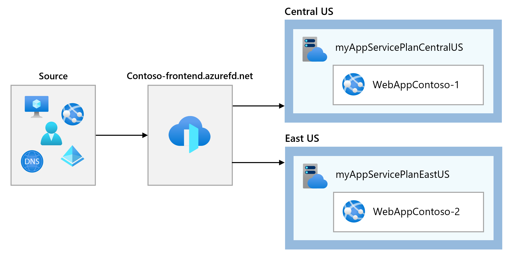
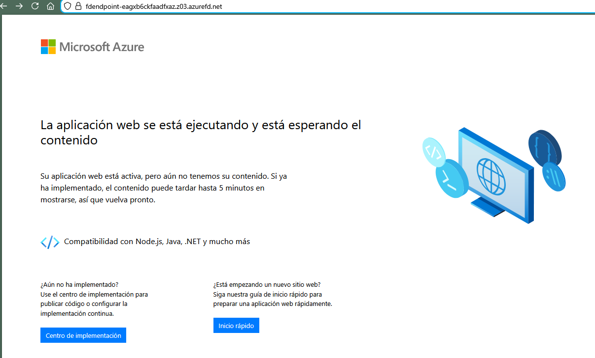
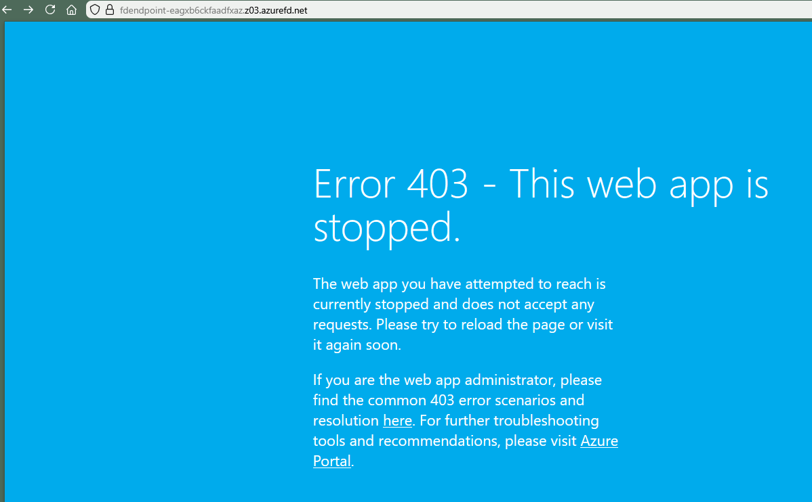

# Deploying a Front Door for web applications

Lab guide: https://microsoftlearning.github.io/AZ-700-Designing-and-Implementing-Microsoft-Azure-Networking-Solutions/Instructions/Exercises/M05-Unit%206%20Create%20a%20front%20door%20for%20a%20highly%20available%20web%20application%20using%20the%20Azure%20portal.html

## Goal 

Configure an Azure Front Door to balance between two instances of a web application. 

## Architecture



## Steps

1. Create the two instances of a web app:
	- Look up for WebApp and select App Services under services. In that page, + Create a new Web App
	- Use the following information and leave the default values when not specified:
		- For the first app
			- Basics:
				- Resource Group: ContosoResourceGroup
				- Name: Use an unique name, in this case it will be WebAppContoso-1-GM
				- Runtime stack: .NET 8 (LTS)
				- Region: Canada Central
				- Windows Plan: Create a new plan with name myAppServicePlanCentralCanada
				- Pricing Plan: Basic B1
			- Review and create the App. 
		- For the second app:
			- Basics:
				- Resource Group: ContosoResourceGroup
				- Name: Use an unique name, in this case it will be WebAppContoso-2-GM
				- Runtime stack: .NET 8 (LTS)
				- Region: West Europe
				- Windows Plan: Create a new plan with name myAppServicePlanWestEurope
				- Pricing Plan: Basic B1
			- Review and create the App. 
	- Once the two apps are deployed, proceed with the creation of the Front Door

2. Create a Front Door for the application
	- Locate Front Door under Load Balancing and content delivery. Create a new Azure Front Door resource with the Quick create option
	- Use the following information to configure the Front door:
		- Resource group: ContosoResourceGroup
		- Name: Use a unique name for the front door, this case will be ContosoFrontDoor-GM
		- Tier: Standard
		- Endpoint name: FDendpoint
		- Origin Type: App Services
		- Origin host name: name of the first web app previously deployed, WebAppContoso-1-GM. Second Web App will be added later WebAppContoso-2-GM
	- Review and create the resource. Wait until the resource is deployed. 
	- NOTE: If you are getting the error "_Microsoft.Cdn is not registered for the subscription._" you might need ti register the Microsoft.Cdn resource provider to your subscription. If that's the case, just simply execute the below command into Azure Powershell and wait that the second command states "Registered"
			```Powershell
			az provider register --namespace Microsoft.Cdn
			az provider show --namespace Microsoft.Cdn --query "registrationState"
			"Registered"
			```
	- Go to the recently deployed Front Door, and in Overview locate the Origin groups below. Click on default-origin-group and add an origin for the second web app, in this case  WebAppContoso-2-GM. Use as Name FDendpoint2 for example and leave the rest by default. 

3. Test the Front Door
	- Locate the Front Door FQDN in the overview blade. This should be FDendpoint followed by a random string. 
	- It can take up to one hour that the app shows the defualt page. Once is fully loaded, it will display the following:
		
	- Now test the global failover by stopping the first webapp: 
		- Go to App services, locate the first Web App and stop it 
	- Now, after some time, refresh the page to confirm the front door is still working. There may be a delay, if getting an error, refresh the page. The same default page should appear.
	- Now stop the second web app doing the same as for the first time 
	- Test again the page, an error should appear as the following. 
		

