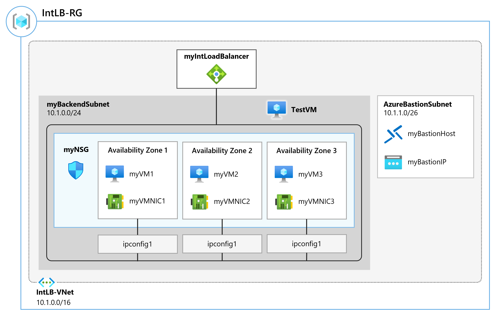

# Module 3 - Lab 01 - Create and configure an Azure load balancer

Lab guide: https://microsoftlearning.github.io/AZ-700-Designing-and-Implementing-Microsoft-Azure-Networking-Solutions/Instructions/Exercises/M04-Unit%204%20Create%20and%20configure%20an%20Azure%20load%20balancer.html

## Goal 

Deploy a Azure load balancer to balance traffic between backend servers in a VNet.

## Architecture



## Steps

1. Create the Backend Subnet
	- Go to Virtual Networks and create a new one with the details:
		- Basics:
			- Resource Group: create a new RG with name IntLB-RG
			- Name: IntLB-VNet
			- Region: (US) East US
		- Security:
			- Under Azure Bastion, select Enable Azure Bastion and then enter the information:
				- Host name: myBastionHost
				- Public IP Address: Create a public IP address with name myBastionIP
		- IP Addresses:
			- IP Address Space: 10.1.0.0/16
			- Delete default subnet
			- + Add a Subnet with name myBackendSubnet and a starting address of 10.1.1.0/24
			- + Add a subnet with name myFrontEndSubnet and a starting address of 10.1.2.0/24
			- Verify that AzureBastionSubnet exists, or add it if needed with a IP address range 10.1.0.0/26
		- Click on Review + Create and finally Create the VNet

2. Create backend servers
	- Download the template files azuredeploy.json and azuredeploy.parameters.json from the official [Github](https://github.com/MicrosoftLearning/AZ-700-Designing-and-Implementing-Microsoft-Azure-Networking-Solutions/tree/master/Allfiles/Exercises/M04)
	- Open a Powershell session, upload the templates to the Powershell session, and excecute:

		```Powershell
		$RGName = "IntLB-RG"
   
		New-AzResourceGroupDeployment -ResourceGroupName $RGName -TemplateFile azuredeploy.json -TemplateParameterFile azuredeploy.parameters.json
		```
	- Continue with next step while the deployment is completed

3.  Create the load balancer
	- Search for the Load Balancer inside "Create a Resource" (Must be the one from microsoft that shows as an Azure Service, and create it. Use the following information:
		- Basics:
			- Resource group: IntLB-RG
			- Name: myIntLoadBalancer
			- Region: (US) East US
			- SKU: Standard
			- Type: Internal
			- Tier: Regional
		- Frontend IP configurations:
			- Add a frontend IP with the following information:
				- Name: LoadBalancerFrontEnd
				- VirtualNetwork: IntLB-VNet
				- Subnet: myFrontEndSubnet
				- Assignment:  Dynamic
		- Finally, review and create the resource.

4. Create Load Balancer resources
	- First, a backend pool with VMs needs to be created. Go to the myIntLoadBalancer resource and, under settings, select Backend pools and add a new one.
		- Use the following information:
			- Name: myBackendPool
			- Virtual Network: IntLB-VNet
			- Backend pool configuration: NIC
			- Add IP Configurations:
				- Select all 3 VMs and add them to the pool.
			- Save and confirm the backend pool with 3 VMs is created. 
	- Second, create a health probe to monitor the status of apps. This adds or removes VMs from the load balancer based on their response to health checks. 
		- Add a health prob with the information:
			- Name: myHealthProbe
			- Protocol: HTTP
			- Port 80
			- Path: /
			- Interval: 15
	- Third, create load balancer rules. This defines how traffic is distributed to the VMs. Frontend IP config for incoming traffic, and the backend IP pool to receive the traffic. Source and destination port are defined in the rule. 
		- Under settings, select Load Balancing rules and add a new one with the information:
			- Name: myHTTPRule
			- IP Version: IPv4
			- Frontend IP address: LoadBalancerFrontEnd
			- Backend pool: myBackendPool
			- Protocol: TCP
			- Port: 80
			- Backend port: 80
			- Health probe: myHealthProbe
			- Session Persistence: None
			- Idle timeout (minutes): 15
			- Floating IP: Disabled

5. Test the load balancer
	- Create a VM to to test
	- basics:
		- Resource Group: IntLB-RG
		- Virtual Machine name: myTestVM
		- Region: (US) East US
		- Availability zone: No infrastructure Redundancy required. 
		- Image: Windows Server 2025 Datacenter Server Core - x64 Gen 2
		- Size: Standard_DS2_v3 - 2 vcpu, 8 GiB memory
		- Username: TestUser
		- Password: provide it
	- Networking:
		- Virtual network: IntLB-VNet
		- Subnet: myBackendSubnet
		- Public IP: none
		- NIC network security group: Advanced 
		- Configure network security group: myNSG
		- Load balancing options: None
	- Review and create the resource
	- Go to the Load Balancer in Azure, and check the Frontend IP address in the overview page. Copy it, in this case 10.1.2.4. 
	- Once deployed, connect via Bastion with the provided credentials and test the load balancer:
		- Use the Powershell session with the command Invoke-WebRequest -Uri http://10.1.2.4 -UseBasicParsing and confirm the traffic is being balanced between servers
	```Powershell
PS C:\Users\TestUser> Invoke-WebRequest -Uri http://10.1.2.4 -UseBasicParsing                                                                                                                                                                                                                                                                                           StatusCode        : 200                                                                                                 StatusDescription : OK
Content           : myVM3

RawContent        : HTTP/1.1 200 OK
                    Accept-Ranges: bytes
                    Content-Length: 7
                    Content-Type: text/html
                    Date: Thu, 26 Mar 2026 00:45:06 GMT
                    ETag: "5a3ce97b5bcdc1:0"
                    Last-Modified: Thu, 26 Mar 2026 00:11:02 GMT
                    Server: ...
Forms             :
Headers           : {[Accept-Ranges, bytes], [Content-Length, 7], [Content-Type, text/html], [Date, Thu, 26 Mar 2026
                    00:45:06 GMT]...}
Images            : {}
InputFields       : {}
Links             : {}
ParsedHtml        :
RawContentLength  : 7


PS C:\Users\TestUser> Invoke-WebRequest -Uri http://10.1.2.4 -UseBasicParsing


StatusCode        : 200
StatusDescription : OK
Content           : myVM1

RawContent        : HTTP/1.1 200 OK
                    Accept-Ranges: bytes
                    Content-Length: 7
                    Content-Type: text/html
                    Date: Thu, 26 Mar 2026 00:47:09 GMT
                    ETag: "78b39571b5bcdc1:0"
                    Last-Modified: Thu, 26 Mar 2026 00:13:59 GMT
                    Server:...
Forms             :
Headers           : {[Accept-Ranges, bytes], [Content-Length, 7], [Content-Type, text/html], [Date, Thu, 26 Mar 2026
                    00:47:09 GMT]...}
Images            : {}
InputFields       : {}
Links             : {}
ParsedHtml        :
RawContentLength  : 7

PS C:\Users\TestUser> Invoke-WebRequest -Uri http://10.1.2.4 -UseBasicParsing


StatusCode        : 200
StatusDescription : OK
Content           : myVM2

RawContent        : HTTP/1.1 200 OK
                    Accept-Ranges: bytes
                    Content-Length: 7
                    Content-Type: text/html
                    Date: Thu, 26 Mar 2026 00:49:54 GMT
                    ETag: "bbcdebecb4bcdc1:0"
                    Last-Modified: Thu, 26 Mar 2026 00:10:16 GMT
                    Server:...
Forms             :
Headers           : {[Accept-Ranges, bytes], [Content-Length, 7], [Content-Type, text/html], [Date, Thu, 26 Mar 2026
                    00:49:54 GMT]...}
Images            : {}
InputFields       : {}
Links             : {}
ParsedHtml        :
RawContentLength  : 7
	```

6. REMOVE THE RG CREATED 
``` Powershell
Remove-AzResourceGroup -Name 'IntLB-RG' -Force -AsJob
```