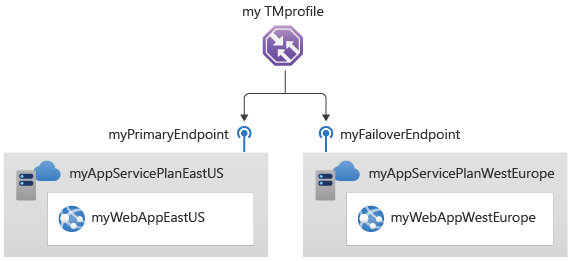

# Module 3 - Lab 02 - Create a Traffic Manager profile using the Azure portal

Lab guide: https://microsoftlearning.github.io/AZ-700-Designing-and-Implementing-Microsoft-Azure-Networking-Solutions/Instructions/Exercises/M04-Unit%206%20Create%20a%20Traffic%20Manager%20profile%20using%20the%20Azure%20portal.html

## Goal

Create a Traffic Manager to handle endpoints for web apps. 
## Architecture



## Steps 

1. Create the web apps
	- Go to Create a resource > Web App in the Azure portal. 
	- Use the following details for the Web Apps. First, East US App:
		- Basics:
			- Resource group: Create new with name Contoso-RG-TM1
			- Name: ContosoWebAppCanadaGM (the last GM is only to make unique the name)
			- Publish: Code
			- Runtime stack: ASP.NET V4.8
			- Operating system: Windows
			- Region Canada Central
			- Windows Plan: Create new with name ContosoAppServicePlanEastUS
			- Pricing plan: Premium V3 P1V3
		- Monitor + secure:
			- Enable Application Insights: No
		- Review and create the Web App
	- Now, for West Europe App:
		- Basics:
			- Resource group: Create new with name Contoso-RG-TM2
			- Name: ContosoWebAppWestEuropeGM (the last GM is only to make unique the name)
			- Publish: Code
			- Runtime stack: ASP.NET V4.8
			- Operating system: Windows
			- Region East US
			- Windows Plan: Create new with name ContosoAppServicePlanWestEurope
			- Pricing plan: Premium V3 P1V3
		- Monitor + secure:
			- Enable Application Insights: No
	- Once deployed, you can see the two apps listen in All services > Web > App services

2. Create a Traffic Manager profile
	- Go to Create a Resource > Traffic Manager profile a create a new one.
	- Use the following information: 
		- Name: Contoso-TMProfileGM (the last GM is only to make unique the name)
		- Routing method: Priority
		- Resource group: Contoso-RG-TM1
		- RG location: East US.
	- Click on Review + create and create the resource. 

3. Add traffic manager endpoints:
	- Go to the created Traffic Manager profile and under Settings > Endpoints add a new endpoint
	- Use the below information for the first endpoint (leave the rest by default): 
		- Name: myPrimaryEndpoint
		- Target resource type: App Service
		- Target resource: ContosoWebAppCanadaGM
		- Priority: 1
		- Click on Add
	- Add a new endpoint, Use the below information for the first endpoint (leave the rest by default): 
		- Name: myFailoverEndpoint
		- Target resource type: App Service
		- Target resource: ContosoWebAppWestEuropeGM
		- Priority: 2
		- Click on Add
	- Configure the health probe settings in Settings > Configuration by changing the protocol to HTTPS and Port to 443. Click on save
	- In Settings > Endpoints again, the monitoring status should change to Online

4. Test the Traffic Manager profile
	- In the Overview page, take note of the DNS Name: http://contoso-tmprofilegm.trafficmanager.net
	- Open the URL in a Web Browser and you should get the default web site of the app. Traffic is being sent to the primary endpoint, as it's set to one. 
	- To test the failover endpoint, disable the primary by going to the endpoints again, edit the myPrimaryEndpoint and, under status, clear the "Enable Endpoint" checkbox and click save. 
	- In a new browser session, open again the site and notice that it's still responding.
	- Do the same with the failover endpoint (do not enable the primary one) and test again in a new browser session. 
	- This time, the page shouldn't load as no endpoints are available. 

5. Clean up resources:
```Powershell
Remove-AzResourceGroup -Name 'Contoso-RG-TM1' -Force -AsJob
Remove-AzResourceGroup -Name 'Contoso-RG-TM2' -Force -AsJob
```
