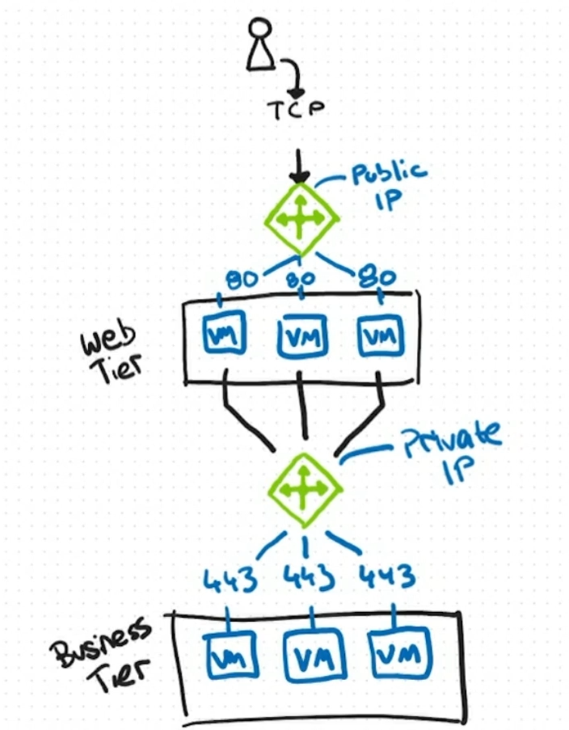

# Azure load balancing: design and implementation considerations

Azure Load Balancer operates at L4 of the OSI model. Single point of contact for clients. Distributes inbound flows that arrive at the load balancer's front end to backend pool instances. These flows are according to configured load balancing rules and health probes. Backend pool instances can be Azure VMS, or instances in a VM scale set. 

## Load balancer types

Load balancer can be public or internal, based on what their front end is facing. Typically, this is used in a 2-tier architecture, standard in Azure, where a public load balancer with a public IP receives requests from external users and load balances between a set of VMs or VM scale sets (called web tier), and then for the internal requests these users-facing resources might need to do internally, an internal load-balancer can be put in place to load balance the traffic between those internal resources (business tier). Each tier of the application can scale independently. Rules can be set so the load balancer listens in a port, and then redirects request in another.

In summary: 
- Public load balancers distribute client traffic from the internet across the resources/VMs. That Internet traffic might come from web browsers, module apps, or other resources. Also, a public load balancer can provide outbound connections for VMs inside the VNet, accomplished by translating their private IPs to public ones.
- Internal load balancers: when only private IPs are required at the front-end. Load balance traffic from internal Azure resources or on-prem networks to other Azure resources inside a VNet.

## Redundancy and reliability

Azure Load Balancer supports availability zones scenarios. It can be either zone redundant, zonal, or nonzonal. Microsoft provides a range of capabilities to support resiliency and recovery. 

- Zone redundant: when available in a region, a Standard Load Balancer can be zone-redundat. A single frontend IP address survives a zone failure (availability zone, data center failure). The frontend IP can be used to reach all (nonimpacted) backend pool members no matter the zone. One or more AZs can fail and the data path survives as long as one zone in the region remains healthy. To deploy a zone redundant Load Balancer, customer must configure each front-end IP setup, so all the front-end IPs are redundant. 
- Zonal: can be chosen to have a frontend guaranteed to a single zone, known as zonal. With this scenario, a single zone in a region serves all inbound or outbound flow. Frontend shares fate with the health of the zone. Data path is unaffected by failures in zones other that where it was guaranteed. Tied up to one specific zone
- Nonzonal: "no zone" frontend. This means that a public load balancer would use a public IP address or prefix, while an internal load balancer would use a private IP. Redundancy is not guaranteed. "no zone" just means that frontend IP is not explicitly pinned to Zone 1, Zone 2 or Zone 3, it is just created without a zone assignment. Today, for public Standard Load Balancer frontends, a "no-zone" public IP may in many cases behave like zone-redundant, because the frontend inherits the zone behavior of the public IP. 
## Azure load balancer SKU

Basic, Standard and Gateway. Basic was already retired on September 30th, 2025. SKUs differ on the needs: scenario scope and scale, features,, and cost. Gateway Load Balancer SKU is suitable for High Performance and high availability scenarios with NVAs. 

Between Standard and Basic, differences:
- Backend pool size: Standard up to 1,000 instances, while basic up to 300.
- Backend pool endpoints: Any VM or VM scale sets in a single VNet for Standard, while VMs in a single availability set or VM scale set in basic.
- Health probes: Standard with TCP, HTTP and HTTPS, while basic with only TCP and HTTP
- Health probe down behavior: Standard makes TCP connections stay alive on an instance probe down and on all probes down, while basic only makes TCP connections to stay alive on an instance probe down, with all TCP connections ending when all probes are down.
- AZs: Zone-redundant and zonal frontends for inbound and outbound traffic in Standard, while not available in Basic
- Diagnostics: Azure Monitor multi-dimensional metrics in Standard, While only Azure Montir logs in basic.
- Secure by default: Standard is closed to inbound flows unless allowed by a NSG. Internal traffic from the VNet to the internal load balancer is allowed. In basic os open by default, and NSGs are optional
- Multiple front ends: inbound and outbound in Standard, while inbound only in basic