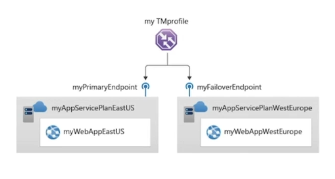

# Azure Traffic Manager

DNS-based traffic load balancer. Allows to distribute the public facing applications around the global Azure regions. Traffic Manager provides as well customer endpoints with high availability and quick responsiveness. Traffic Manager works at DNS level, which is at the application layer. 

Basically, Traffic Manager enables to control how network traffic is distributed to application endpoints running in different Data Centers. 

Simplest architecture desing:

The simplest scenario for which Traffic manager was designed is to fail over from a region to another in case of failure of the primary site, but it can do may other things beyond that. Direct the user to an endpoint based on the health status.

Can be used for availability, just like primary and secondary example. Also for multisite application performance optimization, by running a few copies of an application and directing traffic accordingly between sites. 

Traffic Manager works by leveraging how DNS function works. By the DNS process, the requester will end up getting until the recursive DNS in Azure. When this happens, a CNAME redirection is pointing to the traffic manager, so the request reaches it and the Traffic Manager analyses the request the user put forward, and then returns the best endpoint to them. It passes back to the user the direct endpoint, either stripe, url or IP. Optimizes how an user gets to a service. This happens at the Microsoft Edge locations. Traffic manager doesn't handle the user traffic, just the DNS request. Also, depending on the routing method, Traffic manager allows to improve responsiveness of the application by directing traffic to the endpoint with lowest latency.

Practically, a global DNS name is created ending with trafficmanager.net. In the customer domain servers, they should point a CNAME towards the name ending with trafficmanager.net. When the traffic manager is queried, it will provide the IP based on the rules applied. 

The best endpoint is chosen by the traffic routing method. Traffic-routing method determine which endpoint is returned in the DNS response per DNS request it receives. There are some traffic-routing methods:
- Priority: simplest. A list of endpoints which will be tagged as primary (highest priority), secondary, tertiary, etc. If the primary fails, the Traffic manager will reply DNS requests with the secondary endpoint. Based on availability
- Weighted: direct users to any and all healthy endpoints in the list based on the weighting configured. The logic of the weights is: from a total of users which equals to the sum of the weights, traffic manager will direct the number of users the weight equals. For example, in a list of 3 endpoints with 50, 5 and 50, TM will direct 105 users so 50 use one endpoint, 5 other and the rest 50 the third one. Useful to optimize and increase the performance of the sites. Also used in test environments, when developers want to test with real users some changes but making sure most users are directed to the production ones. If an endpoint goes down, weights are rebalanced between the healthy nodes. 
- Performance: makes a quick check of latency. When a user performs a request, traffic manager uses their IP address and the edge location the user came into to find out what lowest latency endpoint available. Useful for optimized speed. This kind of work like a geographic decision, but it actually evaluates the latency an user will have to reach the endpoint.  If an endpoint goes down, it will direct the users to the closest healthy region. 
- Geographic: design for compliance scenarios. For example, if you have data residency policies for different locations, like EU and US. When a user request comes in, a geo-locate on the IP is done to direct them to the correct region for the compliance scenario customer needs to adhere. 
- Multivalue: all healthy endpoints are returned. 
- Subnet: map a set of end-user IP address ranges to a specific endpoint. The returned endpoint will be the one mapped for that request's source IP. 

Types of endpoints:
- Azure endpoints
- External endpoints: either FQDN or IP
- Other Traffic Manager profile nested. 

Also, multiple layers of profiles can be configured, for example to combine different traffic routing methods. A primary check for geographic lookup, a secondary one that will redirect based on latency and, finally primary or secondary. 

Traffic Manage supports non-Azure endpoints, enabling it to be used with hybrid cloud and on-premises deployments. 

The configuration must consider the TTL of the endpoints. If one endpoint fails, the end-users will still use the failed endpoint for the time the TTL is remaining. 