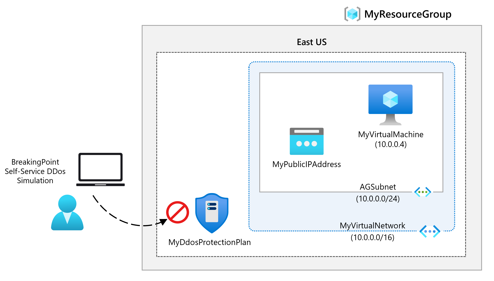

# Module 5 - Lab 01 - Configure DDoS Protection on a VNet

Lab guide: https://microsoftlearning.github.io/AZ-700-Designing-and-Implementing-Microsoft-Azure-Networking-Solutions/Instructions/Exercises/M06-Unit%204%20Configure%20DDoS%20Protection%20on%20a%20virtual%20network%20using%20the%20Azure%20portal.html

## Goal 

Secure a virtual network against DDoS attacks by enabling DDoS protection with a DDoS protection plan, DDoS telemetry, DDoS diagnostic logs and DDoS alerts. 

## Architecture 

## Steps

1. Create a new Resource Group for this lab
	- Go to Resource groups page and create a Resource Group with the name MyResourceGroup.
2. Create a DDoS Protection Plan
	- Go to the resource search and look up for DDoS protection plan, create a new one.
	- Use the newly created resource group, name the Instance as MyDdoSProtectionPlan and create the resource.

3. Enable DDoS Protection on a new VNet
	- Create a new VNet with the following information: 
		- Select the newly created resource group.
		- Name the VNet like MyVirtualNetwork
		- In the Security tab, select enable for DDoS Network Protection and select the corresponding DDoS Protection Plan
	- Review and create the resource 

4. Configure DDoS telemetry on a new public IP
	- Create a new public IP by looking for it in the resources search. Use the below information for the public IP:
		- Resource group: newly created RG.
		- SKU: Standard 
		- Name: MyPublicIPAddress
		- IP Address assignment: Static 
		- DNS Label: make a unique name, in this case mypublicdnsgm
	- Set up telemetry by going to the DDoS Protection Plan resource MyDdoSProtectionPlan. Under monitoring, select Metrics and in the Scope box select the public IP address just created. 
	- In the metric box, select inbound packets dropped DDoS and on Aggregation box select Max

5. Configure DDoS diagnostic logs
	- Look up for the public IP address resource recently created. 
	- Under monitoring, select Diagnostic settings and add a new one. 
	- Set the name as MyDiagnosticSetting in the name box, and under category details check all 3 log categories checkboxes and AllMetrics checkbox.
	- Under destination details, select Send to Log Analytics workspace. There are no workspaces available, so discard the changes and continue with next step

6. Configure DDoS alerts
	- To achieve this step, a VM with the public IP needs to be created, To create the VM, create a new one with the Following information:
		- Name: MyVM
		- Availability options: No infrastructure redundancy required.
		- Image: Ubbuntu Server 24.04 LTS
		- Size: see all sizes and select Standard_D2s_v3 under D-Series v3
		- Authentication type: SSH public key. 
		- Username: azureuser
		- Key pair name: myvm-ssh-key7. 
		- Public inbound ports: none
	- Review and create the resources.
	- In the dialog box for the SSH key creation, select Download private key and create resource
	- Now attach the Public IP address by going to the VM overview page and look up for networking. Next to Network interface, select the NIC for your VM.
	- Under Settings > IP Configurations, select ipconfig1
	- In the Public IP Address field, select the recently created IP mypublicipaddress and save the NIC
	- Now configure the DDoS alerts going to the Public IP Address resource > Monitoring > Alerts > Create alert rule with the following information:
		- Under Scope, select edit resource and select Under DDoS attack or not for the signal name
		- The alert logic should have the operator setting and select value of Greater than or equal to. 
		- Threshold value set to 1 (which means under attack)
		- In the details tab, set the Alert rule name to MyDdosAlert
		- Create the alert 

7. Simulate an attack to test the rule
	- Follow the guide to simulate an attack using this guide https://learn.microsoft.com/es-es/azure/ddos-protection/test-through-simulations