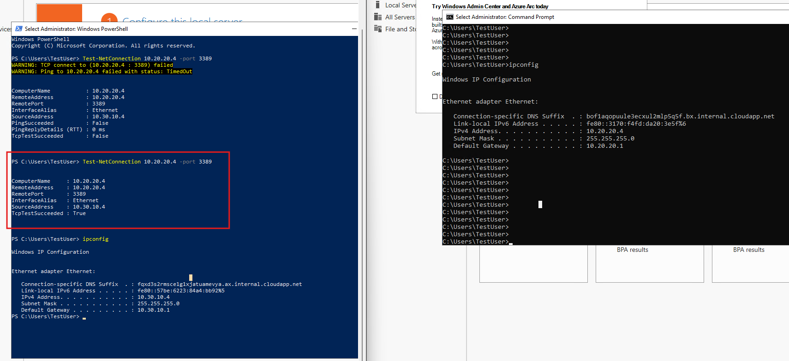

# Lab 03 - Connect two Azure Virtual Networks using global virtual network peering

Lab guide: https://microsoftlearning.github.io/AZ-700-Designing-and-Implementing-Microsoft-Azure-Networking-Solutions/Instructions/Exercises/M01-Unit%208%20Connect%20two%20Azure%20Virtual%20Networks%20using%20global%20virtual%20network%20peering.html

## Goal

Configure connectivity between two VNets by peering them, so allowing traffic flow. 

## Architecture


## Steps
1. Deploy test VMs:
	- Test VMs from [previous](../../dns/labs/02-configure-dns-azure) labs are being used
	- A new VM on manufacturing VNet must be deployed
		- Select Cloud Shell icon (top right) -> poweshell
		- Upload the files ManufacturingVMazuredeploy.json and ManufacturingVMazuredeploy.parameters.json available in [GitHub](https://github.com/MicrosoftLearning/AZ-700-Designing-and-Implementing-Microsoft-Azure-Networking-Solutions/tree/master/Allfiles/Exercises) 
		- Deploy the VMs with the code: 
			```powershell
			$RGName = "ContosoResourceGroup"

			New-AzResourceGroupDeployment -ResourceGroupName $RGName -TemplateFile ManufacturingVMazuredeploy.json -TemplateParameterFile ManufacturingVMazuredeploy.parameters.json
			```
		- Go to Azure -> Virtual Machines
		- Verify it's created

2. Perform an initial test by connecting to the ManufacturingVM and the TestVM1 
	- When connected, open a terminal in TestVM1 and check the IP address by uysing ipconfig. It should show IPv4 Address. . . . . . . . . . . : 10.20.20.4
	- On ManufacturingVM, open a powershell terminal and test the connectivity to TestVM1 with the command
	```powershell 
	Test-NetConnection 10.20.20.4 -port 3389
	```
	- The test should fail, as it can be seen below. No peering has been created, so it's expected
	```powershell
PS C:\Users\TestUser> Test-NetConnection 10.20.20.4 -port 3389
WARNING: TCP connect to (10.20.20.4 : 3389) failed
WARNING: Ping to 10.20.20.4 failed with status: TimedOut


ComputerName           : 10.20.20.4
RemoteAddress          : 10.20.20.4
RemotePort             : 3389
InterfaceAlias         : Ethernet
SourceAddress          : 10.30.10.4
PingSucceeded          : False
PingReplyDetails (RTT) : 0 ms
TcpTestSucceeded       : False
	```
 
3. Create VNet peering between Core Vnet and Manufacturing VNet:
	- Go to Azure Services -> Virtual Networks -> CoreServicesVnet -> Settings -> Peerings -> + Add
	- Create the peering with the following information:
		- (under remote virtual network summary) Peering link name: ManufacturingVnet-to-CoreServicesVnet
		- (under remote virtual network summary) Virtual network: ManufacturingVnet
		- (under remote virtual network peering settings) Allow ‘ManufacturingVnet’ to access ‘CoreServicesVnet’ ticked
		- (under remote virtual network peering settings) ‘ManufacturingVnet’ to receive forwarded traffic from ‘CoreServicesVnet’ ticked
		- (under Local virtual network summary) Peering link name: CoreServicesVnet-to-ManufacturingVnet
		- (under Local virtual network peering settings) Allow ‘CoreServicesVnet’ to access ‘ManufacturingVnet’
		- (under Local virtual network peering settings) Allow ‘CoreServicesVnet’ to receive forwarded traffic from ‘ManufacturingVnet’
		- Leave the rest by default and click Add
	- Tick the box to the left of the newly created peering CoreServicesVnet-to-ManufacturingVnet and select Sync (if not's already Synchornized, check peering Sync status)
	- Check that peering state is "Connected
	- Verify the same in the ManufacturingVnet's peerings
4. Verify connectivity once again:
	- Reattempt the tests from point 2
	- Tests should succeed, as shown in the 
