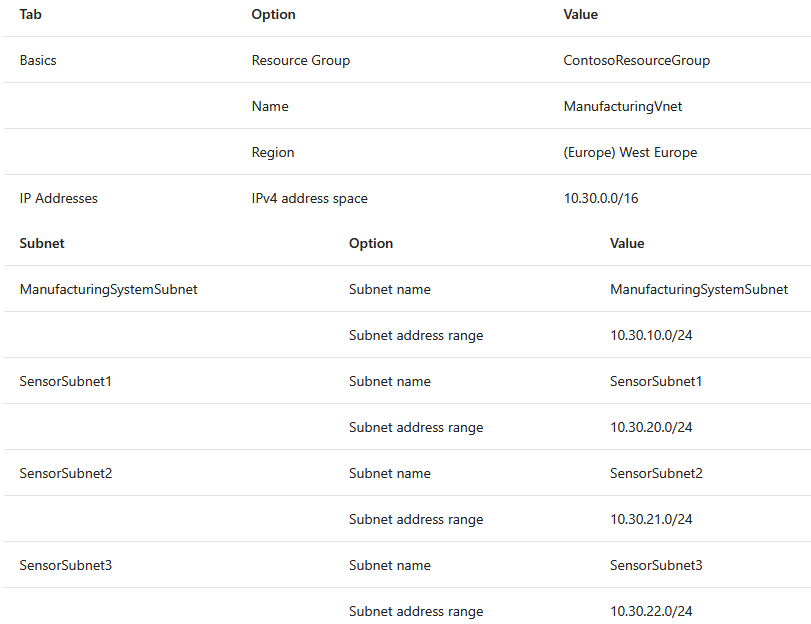
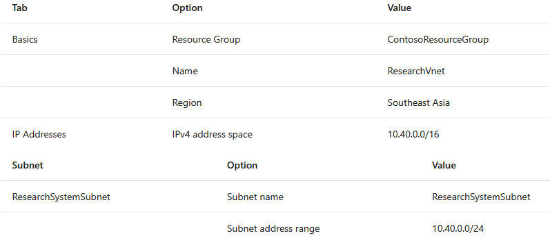
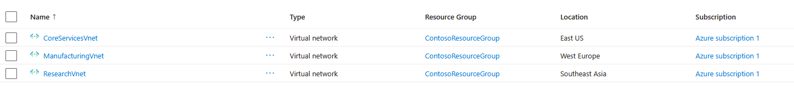
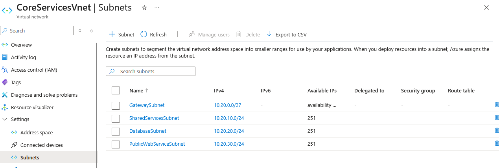

# Lab-01 - Design and implement a Virtual Network in Azure

Lab guide https://microsoftlearning.github.io/AZ-700-Designing-and-Implementing-Microsoft-Azure-Networking-Solutions/Instructions/Exercises/M01-Unit%204%20Design%20and%20implement%20a%20Virtual%20Network%20in%20Azure.html
## Goal
Plan and implement three VNets and subnets for your company future migration onto Azure

## Architecture:
- Diagram with VNets and subnets: 

## Steps

1. **Create Resource Group**
	- Azure services -> Resource groups -> Create
	- Resource group name: ContosoResourceGroup
	- Region: (US) East US
2. **Create Virtual Network: Core Services**
	- Search Virtual Networks -> Create
	- Virtual network name: CoreServicesVnet
	- In IP addresses tab: 
		- Add IPv4 address space: 10.20.0.0/16
		- Create subnets (parameters not mentioned leave them by default):
			- GatewaySubnet: 
				- Subnet purpose: Virtual Network Gateway
				- Name: GatewaySubnet
				- Size: /27
			- SharedServicesSubnet:
				- Name: SharedServicesSubnet
				- Starting address: 10.20.10.0
			- DatabaseSubnet:
				- Name: DatabaseSubnet
				- Starting address: 10.20.20.0
			- PublicWebServiceSubnet
				- Name: PublicWebServiceSubnet
				- Starting address: 10.20.30.0
3. Repeat the previous steps for ManufacturingVnet based on the following data: 
4. Repeat the previous steps for ResearchVnet based on the following data: 
5. Once you are done, you should be seeing the 3 subnets under "All resources" page, refer to image: 
6. To verify subnets creation, select any of the VNets and, under Settings -> Subnets, the subnets should be listed with each corresponding IP range: 